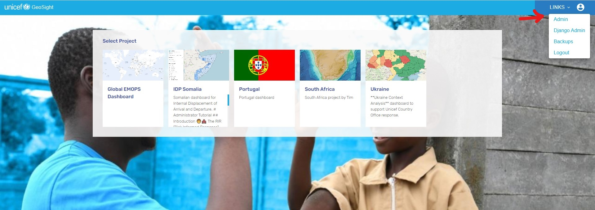
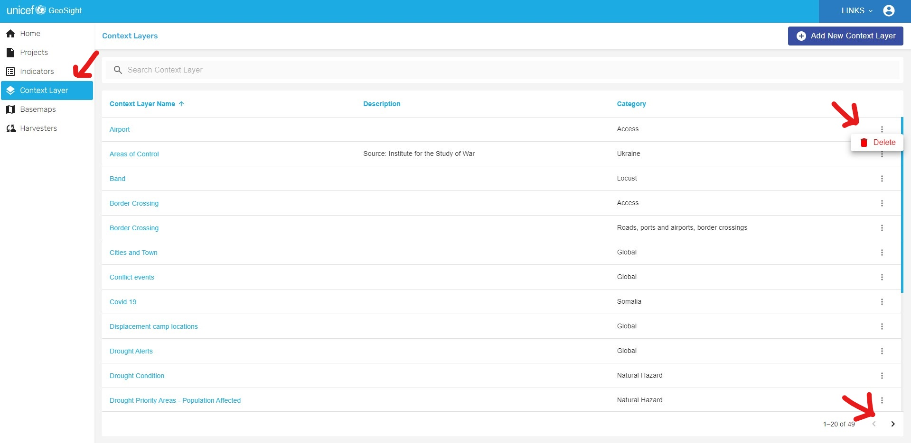

# Context Layers
Context layers are datasets that are not bound to administrative layers and represent a variety of conditions on a global scale. Context layers are the layers that are not the direct data being analyzed, but independent variables that can be used to improve ones understanding of the given situation. These layers include a variety of environmental and humanitarian conditions such as storm forecasts, drought monitors and displacement camp sites. Similarly, these layers can include pieces of basemaps  such as roads, towns and waterways. 

## Context Layers for Administrators
Administrators are able to adjust, add and delete context layers on GeoSight. This allows them to control the availability of layers.

### Accessing and Adjusting Context Layers
As with other administrative abilities, the Context Layer UI can be accessed from the GeoSight home page. To access the administative UI, click the user profile photo and select "Admin".

From here, select "Context Layers"

This will display the Admin UI for context layers and allow you to see, as well as search for, all context layers. In this tab, the context layers are listed and sorted by their name, a breif description and a category to help administators understand their purpose.

On the far left, three horizontal dots, when selected, give the administrator to delete a context layer. This will delete the layer for every project and remove it from GeoSight entirely. 

Finally, on the bottom right the two arrows allow administators to view the multiple pages of context layers.

### Adding Context Layers
Context layers can be added from the Context Layer Admin tab. On the top right you can find the button "Add New Context Layer".

This will bring you to the "Create Context Layer Screen". Here, administrators can provide information required to connect the context layer to GeoSight, describe the context layer and attach security requirements for sensitive information.

Under name enter what you would like the user to call the layer.

Although this is optional, you can provide a brief description of the context layer including identifying information or a citation

Under category select what data group or country you would like to indentify the context layer with.

Enter the URL of the WMS or data source in order to connect GeoSight with the API.

The next step is optional. Here you can URL LEGEND (what is this)

Select the type of geospatial data the context layer is in. 
- "ArcGIS" is a datasource connected to ESRI's ArcGIS Online platform which provides an API link.
- "GeoJSON" is a open-source code based format that keeps data files small before they are displayed.
- "Raster Tile" is data displayed in regular square-shaped intervals that allow for easier data storage.

If you wish to add security to the context layer you can either require a token or a standard username and password that the administator can provide to approved users.

To require a token

Administrators who would like to set a username and password can do so in the final two boxes.

Once all required boxes are complete and you have filled out the optional boxes of your choice click submit in the top right corner. In doing this, the context layer will be created.

## Context Layers for Users
Users cannot adjust or add new context layers. Instead, they can only turn them on and off.

To access context layers as a user from the GeoSight home page, choose a project and then click the tab in thr legened labeled "Context Layers". This wil allow you to see every available context layer which should be turned off as a default. 

To activate context layers, click the slider next to the layer name. The layer is activated and viewable when the slider turns blue and an icon appears both in the legend, and on the map.

Finally, the small black arrow next to a layer name when it is active allows the user to hide/unhide the layer's icon from the legend.

With context layers activated users can use the real-time monitoring tools to compare various indicator to important environmental and socio-economic indicators. They can be an important tool for understanding the larger dynamics of risk and enable users to make decisions based on a more complete picture.
