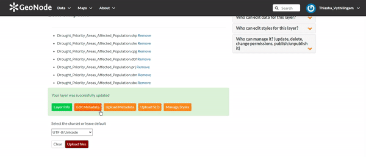

# Layer

## Creating new layer

To add any type of layer to the dashboard, you need to push the data from an online server. 

### Using geonode
To do this you will first need to upload the data to GeoNode or GeoServer
as well as a styled layer descriptor file (SLD). Let’s start by creating the SLD in QGIS. Once you’ve opened QGIS or the mapping software of your choice, upload the
data to your canvas as you would normally do. Once the layers are added, use the **Layer Styling** panel to create an appropriate style for the data. You want to follow
the general theme of the layers that are already on the dashboard. Once you are happy with the style right-click on the layer and select **Properties**.
Go to **Symbology** and click on the drop-down **Style** button. Select **Save Style**. Click on the **Save Style** drop-down option and select **As SLD Style File**.
Click on the ellipse on the right-hand side of the File line to choose a place to save the SLD. Do this for each file you want to upload.

Now we’re going to upload it to GeoNode. Log into your GeoNode or GeoServer account. Click on the **Data** dropdown. Select **Upload Layer**. Please note that
you can only upload one layer at a time. Drop all the data for the layer into the grey box and select **Upload files**.

Once the data has been uploaded, click on **Edit Metadata**. Fill in as much of the metadata information as you have and then click **Return to Layer**.

Click on **Editing Tools**. Click on **Upload** under Styles. Choose your SLD file and then return to layer once again. In Editing tools you can also
change the thumbnail for the layer by uploading a screenshot of the layer.

Right-click on the layer and Select **Inspect**. Select **Network** and hard refresh the page. Select the web address for a tile from the layer
(usually the third option) but if you click on the address, you’ll be able to see if it is the right one.

Copy the link address and paste it into a notepad and change all the words in full capital letters to lower case letters. Use this edited link address as the URL when adding a new layer.   

This was how to upload a context layer but the process of pushing data and creating the SLD file would apply to manually add any layer to the dashboard.

## Adding Basemap Layer

To add a background or basemap layer, click on **Django Admin** and go to the Site Administration page. Click on **+Add** in the Basemap Layers row. This will allow you
to create a basemap by linking it to a URL as well as the instance you would like it to apply to.

You will also be able to add the parameters to the basemap by scrolling down to Basemap Layer Parameters and clicking on the green plus that says **Add**.

## Adding a new Context layer

Click on the user dropdown menu and open **Django Admin**. Click on **+Add** on the Context layers line. Select the instance you would like to add the context layer to.
We will use the existing Somalia instance and Flood Hazard layer as an example. The layer shows areas that are prone to flooding. Enter information in the input boxes as
shown in the images below and save your data once you are happy with it. Click on view site to see your new layer. You will be able to see your new layer in the 'Layers' menu. There is also an option to add other parameters to this layer.

