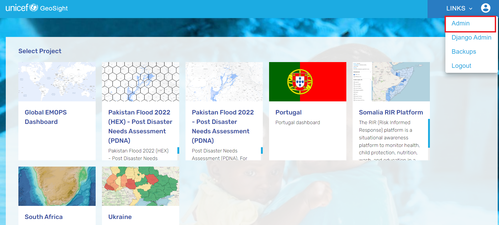
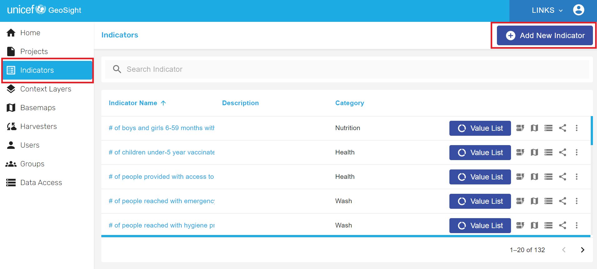

# Adding and managing indicators 

## Adding an indicator

To start the process, navigate to the GeoSight main webpage and click on "Admin'.

Under the "Indicator" panel to the left, click on "Add new Indicator" on the top right.

